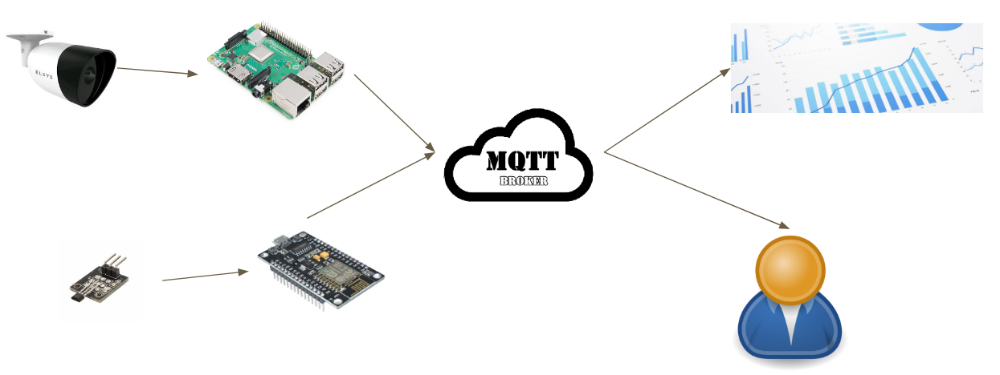

# Restaurant flow analysis
Authors: Raphael Pontes e Willian Beltrão

This repository aims to analyze restaurant flow on real time, for this purpose, it uses concepts of IoT and Machine Learning . This project was implemented on restaurant university at UNICAMP(University of Campinas - Brazil).

For more details, access to our [report](http://www.ic.unicamp.br/~reltech/PFG/2019/PFG-19-51.pdf)  in portuguese.

# Project Topology

The project topology is showed below:

There are two relevant parts, it is hall sensor with ESP8266, and camera with raspberry py 3B+.

# How to use

For this project, it is necessary to install some libraries for detect people using sensor hall and computer vision.

## Sensor hall

For sensor hall, it is necessary to install some libraries on your arduino plataform since this project is based on ESP8266:

  1) ESP8266WiF - Library that allows the ESP8266 to connect and communicate via WIFI.

  2) PubSubClient - Library that allows to use protocol MQTT and communicate to the server doing simple messages publish/subscribe.

  3) ArduinoJson - Library that allows to create files, and in this case messages, on Json Format. This in important library since many servers accept this JsonFormat.
  

## Vision

# References

This project uses other important projects, such as:

1) Yolo Tiny Darknet-nnpack - https://github.com/zxzhaixiang/darknet-nnpack

2) NNPACK - https://github.com/shizukachan/NNPACK
